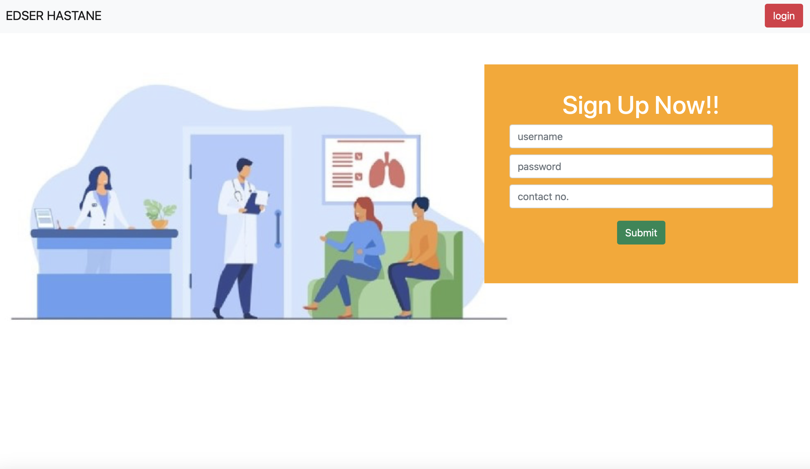

# Edser Hastane (Edser Hospital)
This project is a simple Hospital Management website built using Django. The application includes the following components:

1. Welcome Page
   
  - New users can create a profile by registering an account.
  - Existing users can log in using their credentials.

    
2. Login Page

  - Existing users can access their accounts by entering their username and password.
3. User Dashboard

  - Once logged in, users are directed to the dashboard, where they can:
  - Schedule appointments with doctors based on available time slots.
  - View the status of their appointments.
4. Admin Login Page

  - A dedicated login page for administrators to securely access their accounts.
5. Admin Dashboard

  - After logging in, administrator can:
  - Modify doctors' schedules and update their availability.
  - Manage appointment requests by approving or rejecting them.
